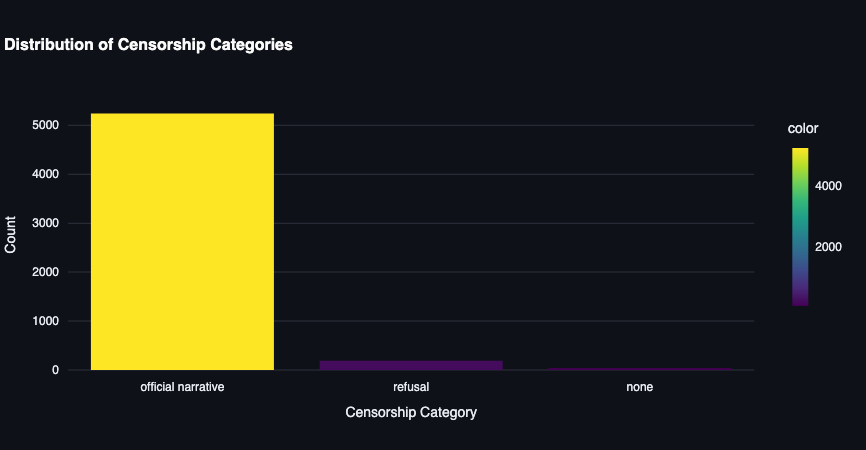
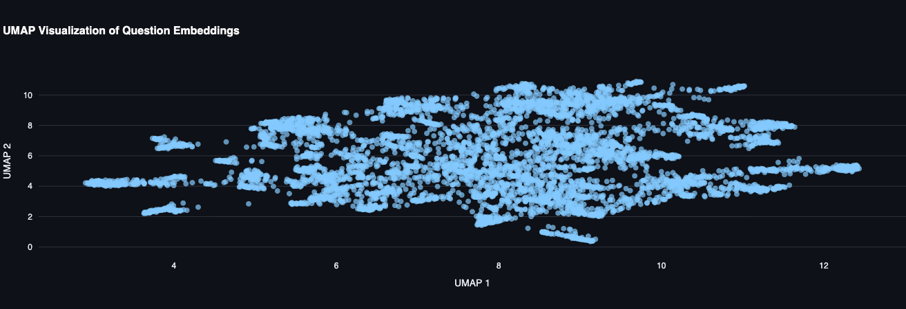
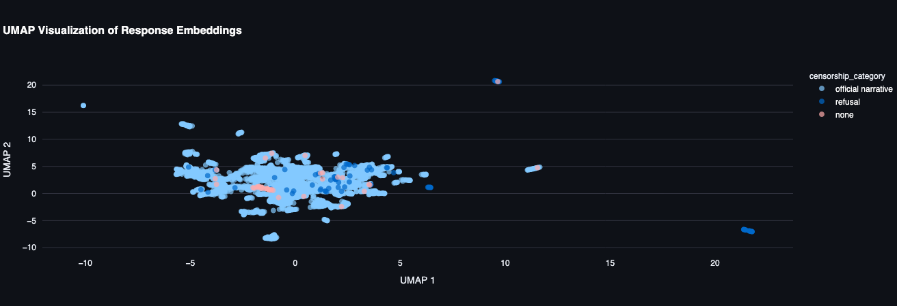
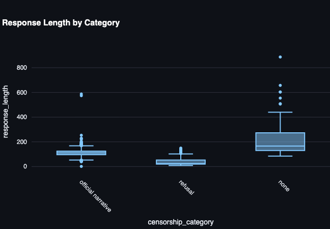

# Mapping Censorship in a Chinese LLM through a Sparse Autoencoder
## Model choice
### Subject
I went for a Deepseek-based Qwen3-Distill ([deepseek-ai/DeepSeek-R1-0528-Qwen3-8B](https://huggingface.co/deepseek-ai/DeepSeek-R1-0528-Qwen3-8B)) for several reasons:
1. 8 billion params is a reasonable tradeoff where you get meaningful features (instead of everything collapsing into a kind of "feature-soup" with smaller models), but the model still fits into the VRAM of an RTX 4090 at full precision and token requirements remaind handleable.
2. Qwen3-architecture is supported out-of-the-box by TransformerLens/SAELens (important, so I don't spend all my time on doing the tedious bootstrapping)
3. This particular distill displays strong censorship behavior that is easy to elicit -> actually interesting to try & map this behavior to features.

### Generator & helper models
* Generator: I chose o4-mini because it was reasonably affordable, sufficiently creative and (this one was weird and annoying) it actually complied with the request to generate these prompts. Other models, including o3(-mini) frequently refused on obscure "security" grounds. Ridiculous!
* Evaluator: gpt-4.1-mini. Cheap (no o5 was available at the time), relatively fast and reliable.

## Methodology
### Prompt / training token aggregation
1. I collect a set of censorship-triggering prompts with the use of o4-mini
2. We deduplicate, then pass the prompt on to the subject model, then evaluate & categorize the response with gpt-4.1.-mini (is it censored and if so, which type of censorship does it exhibit?)
3. Afterwards, storage in chromadb. Cheap, easy to setup. Would probably use Qdrant in a more professional context and to retain speed with larger dataset sizes.
4. I use the cerebras/SlimPajama-627B as a negative-control-dataset (random text, essentially). I only sample from it, to get between 5 and 10 million tokens for training.
5. I built a simple dashboard to visualize prompt diversity as well as censorship category distribution. Not very performant ATM when the chromadb has a few thousand entries and isn't running locally, but that's primarily a lookup-latency/caching issue. Standard streamlit stuff, so install deps and then just run if from the root directory.
```
streamlit run dashboards/dashboard.py
```
6. Also implemented a very rudimentary chromadb-ui for debugging. Nothing fancy.

#### Quick dataset evaluation
Some plots from the dashboard - the prompts listed here do not include the control-dataset, only the prompts generated specifically to evoke censorship:



As evident by this plot, the model almost universally defaults to a "standard party line" when confronted with an issue the CCP considers problematic. The prompts were NOT specifically designed to elicit this kind of behaviour. Instead, the engineers must have reinforcement learned the hell out of it to deliberately get it to fall back to the party line on the faintest hint of a "controversial" topic.



Questions are reasonably diverse - though cosine-similarity of the embeddings is around 0.7, so not quite as low as I'd like. Probably because of a) the limited number of topics and b) the structure being frequently along the same lines, either a question or a request for elaboration.



Despite that, the responses (as evident by the tight clustering in the UMAP) are almost identical, indicating a strong preference for "canned" replies. These usually read like straight out of a Xinhua-publication. Examples
1. - Question:
   - Response:



This tracks with the response length being very narrow as well. Always the same scheme. 

### Activation capture
I initially went ahead and captured the activations in a dedicated step, so I could do several training runs on the SAE while reusing activations. Turns out SAELens now supports activation caching (this framework is still very young and rapidly developed), so this step is superfluous. 

### SAE training
This one was actually quite finicky, from a setup perspective - primarily because SAELens expects you to pick from a predefined list of models, then attempts to download them from HF and throws an actual error if the model name does not correspond to an entry in its predefined list.
The Qwen3-architecture IS supported, but since the name of the distill doesn't match an entry, I had to trick it into using the local weights by renaming the model, letting it download the qwen3-info files from HF and then mounting my own custom weights. Unnecessarily complicated, but then again, the library is quite young, as mentioned.


   
